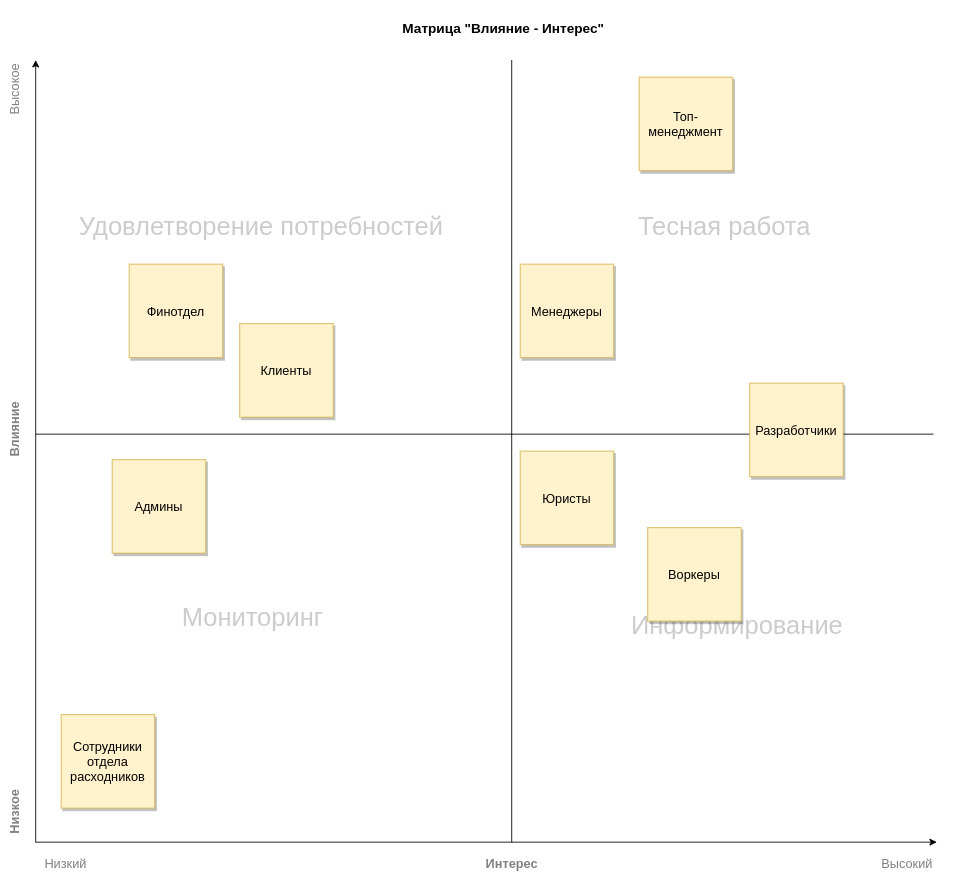

## Стейкхолдеры
Топ-менеджмент
Менеджеры
Клиенты (коты-тестировщики)
Бухгалтеры (финотдел)
Юристы
Админы
Разработчики
Работники отдела расходников
Работники отдела матчинга

### Ключевые консерны:
- Топ-менеджмент:
  - скоринг потенциальных работников уникален в своём роде, и логика его работы сильно выше, чем планировалось. Бизнес в будущем хочет продавать его другим компаниям и тестировать больше гипотез;
  - релизный цикл для всей системы — месяц, для скоринга работников — неделя максимум.
- Финотдел:
  - списывать деньги с клиентов каждую неделю слишком затратно для отдела, поэтому они хотят списывать деньги раз в месяц, но платить воркерам и дальше раз в месяц. При этом необходимо постоянно добавлять новые способы списания денег для клиентов. Воркеры всегда работают через компанию «Золотая шляпа»;
  - боятся потерять любую финансовую информацию и хотят решение, которое будет гарантировать, что всё будет ок.
- Менеджеры:
    - хотят, чтобы о системе ставок не знали другие отделы, иначе будет некрасивая ситуация. Они хотят скрыть эту систему даже от разработчиков, которые не будут ей заниматься, и от начальства;
    - выяснилось, что котам из Happy Cat Box наш проект понравился, поэтому приходит не 10 заказов в день, а 10 заказов в минуту.

### Выбранный архитектурный стиль
Микросервисы

### Разделение контекстов по сервисам

- 2 bounded contexts по расчету и списанию средств должны иметь отдельную БД из-за требования надежного хранения финансовой информации и CatFinComplience
- Контекст по работе с печеньками полностью является внешней системой
- Найм воркеров следует вынести отдельно по нескольким причинам, уникальным только для этого контекста: elasticity, availability, другой релизный цикл, другой уровень средней нагрузки
- Матчинг воркера для клиента должен быть отдельным сервисом из-за отличающейся внутренней логики (из ТЗ - "Система чем-то похожа на map-reduce")
- Про тотализатор и говорить нечего - менеджеры явно дали знать, что хотят сделать его максимально изолированным и скрытым от остальных частей системы
- Контекст планирования выполнения услуг имеет требование по нагрузке, поэтому его стоит вынести отдельно. К тому же этот модель сложна и не стоит добавлять к ней в сервис что-либо еще
- Модель контроля качества работы тоже сложная, ее характеристики схожи с контекстом "Планирование выполнения услуг", но она заслуживает отдельного сервиса
- Сборка расходников для заказа помещается в отдельный сервис, так как не имеет особенных характеристик и требований, и в теории может быть заменена на внешний сервис

### Архитектурные стили сервисов

- Для тотализатора и сервиса расходников подойдет layered monolith из-за простоты и отсутствия специфических требований от сервисов
- Для матчинга воркеров для клментов - pipeline, есть явная подсказка в ТЗ
- Для платежного сервиса - modular monolith, так как он содержит 2 контекста
- Для сервиса контроля качества работы - monolith
- Для отсева лучших кандидатов - microkernel, чтобы добавлять методы тестирования как плагины
- Для планирования выполнения услуг - важна scalability, будет monolith

## Виды баз данных

- Для сервиса по расчету и списанию денежных средств необходим высокий показатель consistency, поэтому изолированная БД будет реляционной
- Для матчинга важны связи и анализ характеристик, основные операции на чтение, поэтому выбор пал на Column Family БД
- Для сервиса отсева лучших кандидатов больше подойдет графовая БД, потому что большинство операций на запись и она подходит по показателям
- Для сервиса сбора расходников для заказа подойдет БД, ориентированная на чтение, реляционная БД вполне подходит
- Для тотализатора также подойдет реляционная БД, во многом благодаря простоте понимания и изучения
- Для сервиса контроля качества работы оптимальным выбором будет реляционная БД
- Для сервиса планирования выполнения услуг важен показатель scalability, поэтому можно попробовать Column Family БД

## Виды коммуникаций

- Связь от "Сборка расходников для заказа" до "Индивидуальная печенька с предсказанием" - Для взаимодействия с сервисом печенек подойдет синхронный вид, так как не известно, какие виды связи поддерживает внешняя система
- Связь от "Планирование выполнения услуг" до "Расчет и списание средств клиентов" - данные не нужно получать быстро, подойдет асинхронный event-driven стиль
- Связь от "Планирование выполнения услуг" до "Расчет и выплата средств сотрудникам" - данные не нужно получать быстро, подойдет асинхронный event-driven стиль
- Связь от "Планирование выполнения услуг" до "Сборка расходников для заказа" - данные не нужно получать быстро (нет требования в ТЗ по скорости взятия в работу заказа на сборку), подойдет асинхронный event-driven стиль
- Связь от "Планирование выполнения услуг" до "Тотализатор" - данные не нужно получать быстро, подойдет асинхронный event-driven стиль. Единственный нюанс - менеджеры вряд ли осилят сложность асинхронных коммуникаций, поэтому синхронный стиль также подойдет
- Связь от "Планирование выполнения услуг" до "Контроль качества работы" - данные не нужно получать быстро, подойдет асинхронный event-driven стиль
- Связь от "Планирование выполнения услуг" до "Матчинг воркера для клиента" - нет требований к скорости подбора воркера на заказ, подойдет асинхронный event-driven стиль
- Связь от "Отсев лучших кандидатов" до "Планирование выполнения услуг" - данные не нужно получать быстро, подойдет асинхронный event-driven стиль

## [ADR](lesson_3/adr.md)

## Фитнес функции

### Общие для системы

- Test coverage не ниже N%
- Проверка периодичности релиза не реже раза в месяц. Использовать встроенные инструменты Jira по отслеживанию релизов, узнать у менеджеров, где взять информацию
- Вычисления процента ошибок сервера, downtime и прочих технических метрик с помощью Grafana. Установить приемлемые рамки для заданных метрик (проверка сбоев системы)
- Проверка реализации архитектурного стиля. Узнать у разработчиков, как можно автоматизировать и проверять

### Расчеты, списания и выплаты

- Периодическая проверка хранимой информации на наличие конфиденциальных пользовательских данных. Анализ данных в коммуникациях между сервисами

### Планирование выполнения услуг

- Прохождение нагрузочных тестов на scalability

### Матчинг

- Проверка coupling и cohesion

### Найм воркеров

- Проверка coupling и cohesion
- Прохождение нагрузочных тестов на elasticity
- Проверка downtime не реже раз в месяц
- Проверка периодичности релиза не реже раза в неделю
